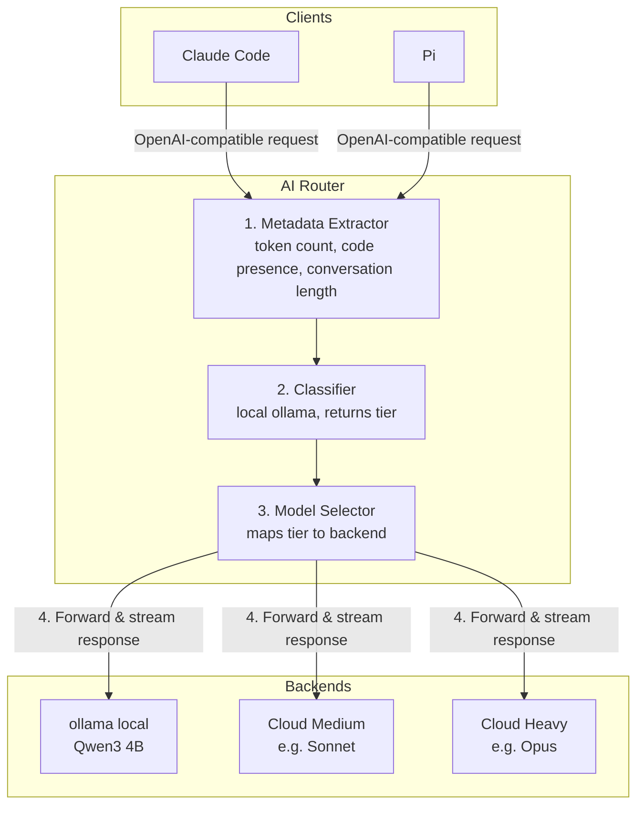

# AI Router

A local AI prompt router that classifies requests by complexity and routes them to the appropriate model tier. Drop-in replacement for any OpenAI-compatible endpoint.

## How It Works



## Quick Start

```bash
# Install
pip install -e ".[dev]"

# Configure (edit config.yaml with your models)
cp config.yaml config.yaml

# Run
ai-router
```

## Configuration

Edit `config.yaml` to define your tiers and models. See the default config for the full schema.

## Usage

Point any OpenAI-compatible client at `http://localhost:8080`:

```bash
# Auto-route (classifier picks the tier)
curl http://localhost:8080/v1/chat/completions \
  -H "Content-Type: application/json" \
  -d '{"model": "auto", "messages": [{"role": "user", "content": "Hi"}]}'

# Passthrough (skip classifier, use specific model)
curl http://localhost:8080/v1/chat/completions \
  -H "Content-Type: application/json" \
  -d '{"model": "claude-opus", "messages": [{"role": "user", "content": "Complex task..."}]}'
```

### Claude Code

Set `base_url: http://localhost:8080` in your Claude Code config.

### Pi

Add as a custom provider in `models.json` pointing at `http://localhost:8080`.

## Development

```bash
pip install -e ".[dev]"
pytest -v
```
