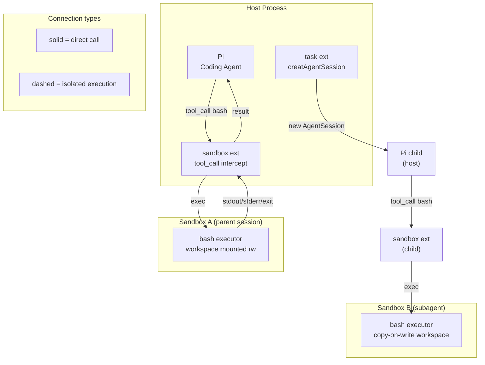
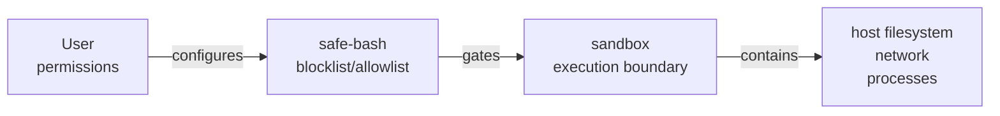

# Sandbox Extension Proposal

Kern currently gates bash calls via `safe-bash` (allow/blocklist) but executes
them on the host. This proposes adding a `sandbox` extension that routes bash
execution through an isolated environment without touching the host.

## Isolation tier taxonomy

Four tiers, weakest to strongest. Pick the highest your platform supports.

| Tier | Technology | Kernel shared? | Root needed? | Cross-platform |
| ------ | ----------- | --------------- | ------------- | ---------------- |
| 0 | safe-bash (current) | yes | no | yes |
| 1 | OCI container (Docker / Podman / nerdctl / Colima) | yes | no (rootless) | yes |
| 2 | nsjail / bubblewrap + Landlock | yes | no (pasta/user-ns) | Linux only |
| 3 | gVisor | no (own kernel) | no | Linux only |
| 4 | Firecracker | no (microVM) | no | Linux only |

**Key property:** tiers 1-2 share the host kernel - a kernel escape exits the
sandbox. Tiers 3-4 do not. For untrusted or adversarial agent code, use tier 3+.
For trusted agents doing risky work (rm, network calls), tier 1-2 is enough.

## Architecture in kern



Each Pi process (parent or subagent) loads the sandbox extension independently.
The extension owns one sandbox instance per session. Sessions do not share
sandbox state - isolation is automatic when task spawns subagents.

## Extension design

New extension: `extensions/sandbox/index.ts`

```text
extensions/sandbox/
  index.ts          # intercepts tool_call(bash), routes to backend
  backends/
    oci.ts          # tier 1 - OCI container (docker/podman/nerdctl/colima)
    nsjail.ts       # tier 2 - Linux, rootless, fast
  config.ts         # loads ~/.pi/agent/settings.json#sandbox
```

### Config shape (`settings.json`)

```json
{
  "sandbox": {
    "backend": "oci",
    "runtime": "auto",
    "network": "none",
    "workspace": "rw",
    "image": "ubuntu:24.04",
    "allowlist": ["example.com:443"]
  }
}
```

- `backend`: `"oci"` | `"nsjail"` | `"none"` (disables sandbox)
- `runtime`: `"auto"` | `"docker"` | `"podman"` | `"nerdctl"` (auto-detected by PATH probe)
- `network`: `"none"` | `"allowlist"` | `"full"`
- `workspace`: `"rw"` | `"ro"` | `"cow"` (copy-on-write via overlay)
- `allowlist`: domains/IPs permitted when `network: "allowlist"`

Colima does not need a `runtime` entry - it exposes a standard Docker-compatible
socket that `docker` and `nerdctl` use transparently. Set `runtime: "docker"` or
`"nerdctl"` depending on which CLI you installed alongside it.

### Intercept lifecycle

```text
session_start  → spin up sandbox container/jail, mount workspace
tool_call(bash)→ exec command inside sandbox, stream stdout/stderr
session_end    → tear down (ephemeral) or snapshot (persistent)
```

No other extensions change. `safe-bash` still runs first and can block before
the command even reaches the sandbox - the two are composable.

## Permission model



- **safe-bash** decides whether the command runs at all (blocklist/allowlist)
- **sandbox** decides what the command can reach if it runs
- They compose: both active = gate + contain

For subagents the same chain applies per session. A child session that inherits
a restrictive `network: "none"` sandbox cannot reach the internet regardless of
what the model tries.

## Multi-agent isolation

Each `createAgentSession` (from the `task` extension) spawns a child Pi process.
That child loads the sandbox extension, which creates a **new** sandbox instance.
Isolation is structural - no shared mutable filesystem, no shared network
namespace between siblings.

Shared read-only artifacts flow through the parent session: parent writes a file
to workspace, mounts it read-only into child sandboxes, children can read it but
not modify it. Results come back through Pi's extension API (events / globalThis
message bus), not through direct inter-sandbox networking.

## Internet access

Controlled by `sandbox.network`:

| Value | nsjail | OCI (any runtime) |
| ------- | -------- | -------- |
| `none` | `--iface_no_lo` + net namespace | `--network none` |
| `allowlist` | pasta + egress seccomp/iptables | custom bridge + iptables |
| `full` | pasta --no-config | default bridge |

Allowlist: resolved at sandbox start, not per-request. DNS leaks handled by
pointing DNS to a filtering resolver inside the sandbox.

## A2A communication

Sandboxed agents do not have direct network paths to each other.
Communication is orchestrated by the host Pi session via the extension API:

```text
parent Pi
  ├── writes shared artifact → file (workspace, read-only mount in children)
  ├── passes structured result via task extension return value
  └── coordinates next agent via globalThis message bus
```

No inter-sandbox sockets. If agents need to share a service (e.g., a DB), the
parent starts it on the host and mounts the socket/port into each sandbox
explicitly via backend config.

## TUI integration

Pi's TUI runs on the host, not inside a sandbox. The sandbox only handles
bash execution. Stdout/stderr stream back to Pi normally, so terminal output
(progress bars, color, interactive prompts via `ctx.ui`) works without changes.

TUI tools that need a PTY (e.g., `vim` invoked by the agent) require
`--pty` / `<runtime> exec -it`. The backend allocates a PTY when the command
requests one. For non-interactive agent use this is rare.

## Exploit surface

| Vector | Tier 1 (OCI) | Tier 2 (nsjail) | Tier 3 (gVisor) | Tier 4 (Firecracker) |
| -------- | ---------------- | ----------------- | ----------------- | ---------------------- |
| Filesystem escape | blocked (bind mounts) | blocked (mount ns) | blocked | blocked |
| Network reach host | blocked | blocked | blocked | blocked |
| Kernel exploit | **host kernel reachable** | **host kernel reachable** | no (own kernel) | no (own kernel) |
| Side channel (Spectre etc.) | **present** | **present** | **present** | no |
| setuid escalation | blocked | PR_SET_NO_NEW_PRIVS | N/A | N/A |

For most kern use cases (trusted agent, risky shell commands, tool installs)
tier 1 OCI is sufficient. Tier 3+ only matters when the code itself is
untrusted (user-provided scripts, LLM-generated code run unsupervised).

## Tool installation without host impact

- Tier 1-2: `npm install`, `pip install`, `apt install` run inside the sandbox.
  Nothing persists to the host. The sandbox is ephemeral by default.
- Persistent environments: snapshot the sandbox after setup, reuse as a base
  image / template (Docker image layers, nsjail bind-mount overlay).
- Pre-baked images: a `sandbox.image` config pointing to a custom image with
  tools pre-installed. No runtime installs needed.

## OCI runtime compatibility

All four runtimes implement the same `run`/`exec`/`stop`/`rm` CLI surface.
The backend calls one binary; which binary is runtime config.

| Runtime | Platform | Notes |
| --------- | ---------- | ------- |
| Docker Desktop | macOS, Linux | commercial license for large orgs |
| Podman | macOS, Linux | rootless by default, daemonless |
| nerdctl | macOS (via Colima), Linux | containerd-native |
| Colima | macOS | Lima-based VM; exposes Docker/containerd socket to host CLIs |

Auto-detection probe order (`runtime: "auto"`): `docker` → `podman` → `nerdctl`.
First one found in PATH wins. Override with explicit `runtime` to fix a machine.

**Colima note:** Colima is a VM host, not a CLI. Install either `docker` CLI or
`nerdctl` alongside it and point `runtime` at whichever you chose. Colima
exposes a standard socket both understand.

## Implementation phases

### Phase 1 - OCI container backend (MVP)

- `extensions/sandbox/` with OCI backend only
- Intercepts `tool_call(bash)`, runs `<runtime> exec` into a session container
- `runtime: "auto"` probes PATH for `docker`, `podman`, `nerdctl` in that order
- Colima: no special handling - exposes standard socket, use `docker` or `nerdctl` CLI
- `network: "none"` default
- `workspace` mounted rw
- No persistent snapshots
- Works on macOS (Docker Desktop, Podman Desktop, Colima) and Linux (all four runtimes)

### Phase 2 - nsjail backend

- Linux-only, rootless via pasta
- Kafel seccomp policy (allowlist syscalls)
- Landlock filesystem rules
- Faster cold start than Docker

### Phase 3 - Per-subagent isolation

- task extension passes `sandboxId` to child sessions
- Each child gets `cow` workspace copy
- Parent workspace is read-only in children

### Phase 4 - Network allowlist

- DNS filtering resolver in sandbox
- Egress domain allowlist config

### Phase 5 - gVisor / Firecracker

- For untrusted code scenarios
- Requires Linux, possibly separate machine
