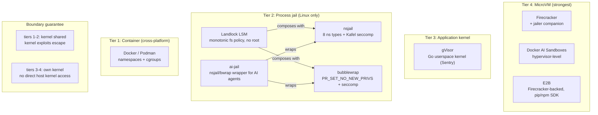

# AI Agent Sandbox Technology - Research Findings

Adversarially verified research (103 agents, 21 sources fetched, 25 claims
verified with 3-vote majority). Claims marked with vote ratio; 3-0 = unanimous,
2-1 = split (reason noted), 0-3 = refuted (not included).

## Summary

Four distinct isolation tiers exist for running AI agent subprocesses safely.
At the strongest end, microVM-based tools provide hardware-enforced guest/host
separation. gVisor occupies a middle tier with an application-level kernel.
Process-level sandboxes (nsjail, bubblewrap, ai-jail) offer strong isolation but
share the host kernel. Tool installation without host impact is well-supported
across all tiers. Multi-agent isolation, internet access control, and TUI
support vary significantly by tool.

## Isolation tiers

| Tier | Tech | Kernel shared? | Root needed? | OS |
| ------ | ------ | --------------- | ------------- | ----- |
| 1 | Docker container | yes | no (rootless) | all |
| 2 | nsjail / bubblewrap + Landlock | yes | no (pasta/user-ns) | Linux |
| 3 | gVisor | no (own userspace kernel) | no | Linux |
| 4 | Firecracker / Docker AI Sandbox / E2B | no (microVM) | no | Linux |

---

## Findings

### MicroVM tier (Firecracker, Docker AI Sandboxes, E2B)

**Claim:** MicroVM-based sandboxes provide hardware-enforced isolation with a
companion `jailer` process for defense-in-depth and are the strongest boundary
for untrusted AI workloads.

**Confidence:** high | **Vote:** 3-0 all three tools

**Evidence:**

- Firecracker ships a companion `jailer` program that applies Linux userspace
  security barriers around each microVM as a second line of defense if the
  virtualization barrier is compromised.
- Docker AI Sandboxes use hypervisor-level isolation (not container namespaces)
  with workspace mounting and networking.
- E2B: "Each sandbox is powered by Firecracker - a microVM made to run untrusted
  workflows."

**Sources:** <https://firecracker-microvm.github.io/>, <https://docs.docker.com/ai/sandboxes>,
<https://e2b.dev/>

---

### E2B - tool installation

**Claim:** E2B supports in-sandbox package installation (pip, npm) and custom
snapshot templates, enabling tool installation for AI agents without any host
impact.

**Confidence:** high | **Vote:** 3-0

**Evidence:** SDK methods `.pipInstall()`, `.npmInstall()` install into live
sandbox instances only - not persisted to the host. Custom templates allow
pre-baking environments. "Supports pip, npm, and custom sandbox templates."

**Source:** <https://e2b.dev/>

---

### gVisor

**Claim:** gVisor is neither a syscall filter nor a traditional VM - it reimplements
every Linux syscall in a Go userspace application kernel (the Sentry), eliminating
direct host kernel exposure while maintaining lower resource footprint and faster
startup than full VMs.

**Confidence:** high | **Vote:** 3-0 on architecture; 2-1 on strongest exploit-surface
wording (split on "cannot be directly exploited" phrasing, architecture itself unanimous)

**Evidence verbatim from README:**

- "No system call is passed through directly to the host. Every supported call
  has an independent implementation in the Sentry."
- "Not a syscall filter (e.g. seccomp-bpf), nor a wrapper over Linux isolation
  primitives... also not a VM in the everyday sense."
- "Written in Go to avoid security pitfalls" - no use-after-free, no
  uninitialized variables, no stack overflow.
- "Provides many security benefits of VMs while maintaining the lower resource
  footprint, fast startup, and flexibility of regular userspace applications."

**Sources:** <https://gvisor.dev/docs/>, <https://github.com/google/gvisor>

---

### nsjail

**Claim:** nsjail provides a comprehensive process isolation stack using 8 Linux
namespace types (UTS, MOUNT, PID, IPC, NET, USER, CGROUPS, TIME), cgroups,
rlimits, and seccomp-bpf via Kafel policy syntax - with a default-KILL allowlist
model and granular network options including rootless userland networking via
pasta.

**Confidence:** high | **Vote:** 3-0 on isolation stack and seccomp allowlist; 2-1
on network granularity (MACVLAN requires root, pasta does not - claim correctly
distinguishes these)

**Evidence:**

- All 8 namespace types (CLONE_NEW* flags confirmed in config.proto), cgroup
  resource control, rlimits.
- Seccomp uses `ALLOW { ... } DEFAULT KILL` - unspecified syscalls are killed.
- 3 network modes: full net namespace clone (default), MACVLAN cloning (root
  required), pasta userland networking (`--use_pasta`, rootless).

**Source:** <https://github.com/google/nsjail>

---

### Bubblewrap

**Claim:** Bubblewrap applies `PR_SET_NO_NEW_PRIVS` to block setuid privilege
escalation and supports seccomp-bpf filters to narrow the kernel attack surface,
making it a lightweight process-level sandbox suitable as a building block.

**Confidence:** high | **Vote:** 3-0 on both sub-claims

**Evidence verbatim from README:** "bubblewrap uses PR_SET_NO_NEW_PRIVS to turn
off setuid binaries, which is the traditional way to get out of things like
chroots." Source confirms `prctl(PR_SET_NO_NEW_PRIVS, 1, ...)` annotated "Never
gain any more privs during exec." Seccomp filters via `--seccomp` and
`--add-seccomp-fd`.

**Note:** A claim that bubblewrap requires no root at all was refuted 0-3.
Privilege requirements depend on configuration (user namespaces may require
distro sysctl settings).

**Source:** <https://github.com/containers/bubblewrap>

---

### Landlock LSM

**Claim:** Landlock LSM enables unprivileged processes to apply monotonically
restrictive filesystem policies to themselves - no root required via
`PR_SET_NO_NEW_PRIVS` - and policies can never be relaxed once applied.

**Confidence:** medium | **Vote:** 3-0 on monotonic policy; 2-1 on unprivileged
use mechanism

**Evidence:**

- "Once a thread is landlocked, there is no way to remove its security policy;
  only adding more restrictions is allowed." (3-0)
- Unprivileged path requires `PR_SET_NO_NEW_PRIVS` or `CAP_SYS_ADMIN` in the
  relevant namespace. (2-1 split - CAP_SYS_ADMIN is conventionally privileged,
  introducing a logical tension in the "unprivileged" framing)

**Caveat - network isolation refuted:** A claim about Landlock V4 network port
filtering was rejected 0-3. Landlock's filesystem restriction is well-confirmed;
network isolation claims are fragile and should not be relied on.

**Source:** <https://www.kernel.org/doc/html/latest/userspace-api/landlock.html>

---

### ai-jail - security boundary statement

**Claim:** Process-level sandboxes (ai-jail, nsjail, bubblewrap + Landlock) are
explicitly NOT hardware isolation: kernel escapes, timing/cache side channels, and
scheduler interference are out of scope. Unknown malware warrants a disposable VM.

**Confidence:** high | **Vote:** 3-0

**Evidence verbatim from ai-jail README ("What this is and isn't"):**

> "All backends depend on host kernel correctness. Kernel escapes are out of
> scope. These are process sandboxes, not hardware isolation... Timing/cache side
> channels and scheduler interference still exist in process sandboxes... If you
> are dealing with unknown malware, use a disposable VM. Treat ai-jail as one
> layer, not the whole boundary."

This is the clearest statement of the security boundary in the entire verified
claim set and applies broadly to all process-sandbox tools.

**Sources:** <https://github.com/akitaonrails/ai-jail>, <https://github.com/google/nsjail>

---

## Refuted claims (do not rely on)

- Docker AI Sandboxes run with each sandbox having its own Docker daemon - **refuted 0-3**
- ai-jail uses four stacked Linux security layers (bubblewrap + nsjail + seccomp + Landlock
  simultaneously) - **refuted 0-3** (actual layering differs)
- Landlock V4 can restrict network ports on Linux 6.5+ - **refuted 0-3**
- Bubblewrap requires no root at all - **refuted 0-3** (depends on distro sysctl)

## Landscape map

## Key properties by concern

| Concern | Tier 1 (Docker) | Tier 2 (nsjail/bwrap) | Tier 3 (gVisor) | Tier 4 (Firecracker) |
| --------- | ---------------- | ---------------------- | ----------------- | ---------------------- |
| Kernel exploit | host reachable | host reachable | no (own kernel) | no (own kernel) |
| Side channels | present | present | present | eliminated |
| Rootless | yes | yes (pasta) | yes | yes |
| macOS support | yes | no | no | no |
| Cold start | ~1s | <100ms | ~100ms | ~125ms |
| Tool install (no host) | yes | yes | yes | yes (SDK) |
| Network off by default | `--network none` | net namespace | yes | yes |
| Per-agent isolation | 1 container/agent | 1 jail/agent | 1 runsc/agent | 1 microVM/agent |
