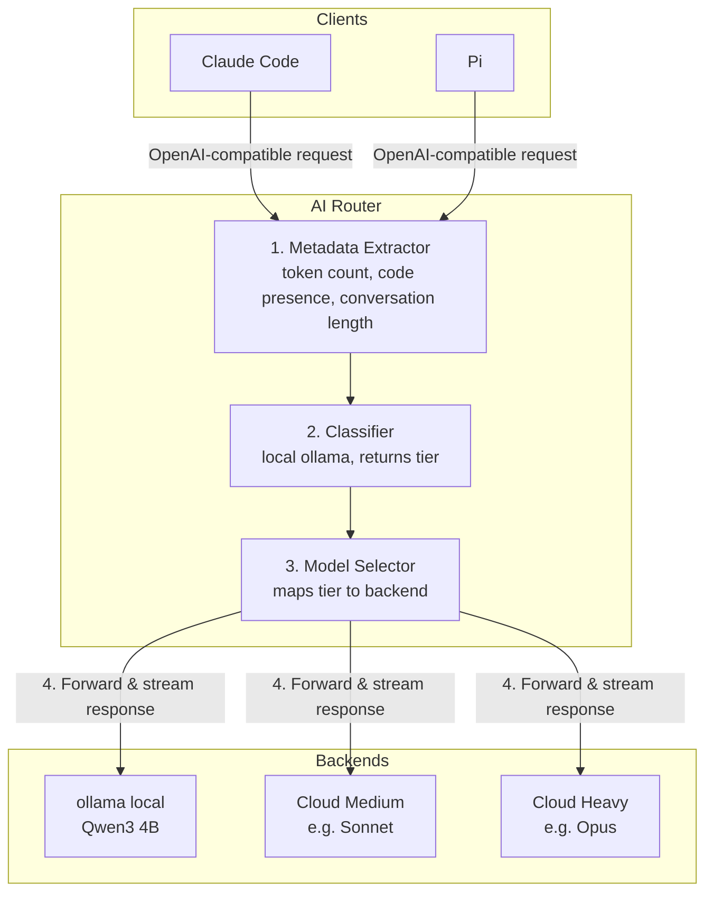

# AI Router Implementation Plan

> **For agentic workers:** REQUIRED SUB-SKILL: Use superpowers:subagent-driven-development (recommended) or superpowers:executing-plans to implement this plan task-by-task. Steps use checkbox (`- [ ]`) syntax for tracking.

**Goal:** Build a local AI prompt router that classifies requests via ollama and routes them to the appropriate model tier, exposing an OpenAI-compatible streaming API.

**Architecture:** FastAPI app with async streaming. Incoming requests pass through a metadata extractor, then a classifier (ollama call), then get forwarded to the selected backend via httpx streaming. YAML config defines tiers and models.

**Tech Stack:** Python 3.11+, FastAPI, uvicorn, httpx, pyyaml, pytest, pytest-httpx

---

## File Structure

```
ai-router/
├── pyproject.toml              # project metadata, dependencies, scripts
├── config.yaml                 # default configuration
├── src/
│   └── ai_router/
│       ├── __init__.py
│       ├── main.py             # FastAPI app, startup, entrypoint
│       ├── config.py           # YAML config loading and validation
│       ├── models.py           # pydantic models for config, requests, responses
│       ├── metadata.py         # metadata extraction from messages
│       ├── classifier.py       # ollama classifier client
│       ├── proxy.py            # streaming proxy to backends
│       └── backends/
│           ├── __init__.py
│           ├── base.py         # backend protocol/interface
│           ├── ollama.py       # ollama backend adapter
│           └── anthropic.py    # anthropic backend adapter
└── tests/
    ├── conftest.py             # shared fixtures
    ├── test_config.py
    ├── test_metadata.py
    ├── test_classifier.py
    ├── test_proxy.py
    ├── test_backends.py
    └── test_api.py             # integration tests for endpoints
```

---

### Task 1: Project Setup

**Files:**
- Create: `pyproject.toml`
- Create: `src/ai_router/__init__.py`
- Create: `src/ai_router/main.py`
- Create: `config.yaml`

- [ ] **Step 1: Create pyproject.toml**

```toml
[project]
name = "ai-router"
version = "0.1.0"
description = "Local AI prompt router with OpenAI-compatible API"
requires-python = ">=3.11"
dependencies = [
    "fastapi>=0.115",
    "uvicorn[standard]>=0.30",
    "httpx>=0.27",
    "pyyaml>=6.0",
    "pydantic>=2.0",
]

[project.optional-dependencies]
dev = [
    "pytest>=8.0",
    "pytest-asyncio>=0.24",
    "pytest-httpx>=0.34",
    "httpx[http2]>=0.27",
]

[project.scripts]
ai-router = "ai_router.main:cli"

[build-system]
requires = ["hatchling"]
build-backend = "hatchling.build"

[tool.hatch.build.targets.wheel]
packages = ["src/ai_router"]

[tool.pytest.ini_options]
asyncio_mode = "auto"
testpaths = ["tests"]
```

- [ ] **Step 2: Create minimal main.py**

```python
from fastapi import FastAPI

app = FastAPI(title="AI Router")


@app.get("/health")
async def health():
    return {"status": "ok"}


def cli():
    import uvicorn
    uvicorn.run("ai_router.main:app", host="0.0.0.0", port=8080, reload=True)
```

- [ ] **Step 3: Create __init__.py**

```python
```

(Empty file)

- [ ] **Step 4: Create default config.yaml**

```yaml
server:
  port: 8080
  host: 0.0.0.0

classifier:
  endpoint: http://localhost:11434
  model: qwen3:4b
  system_prompt: |
    You are a prompt router. Given a user message and metadata,
    classify it into one of the available tiers.
    Respond with ONLY valid JSON: {"tier": "<tier_name>", "reason": "<brief reason>"}
  metadata:
    - token_count
    - has_code
    - conversation_turns
    - last_message_length
  timeout_ms: 5000

tiers:
  - name: local
    description: Simple questions, formatting, short factual answers
    models:
      - name: qwen3:4b
        endpoint: http://localhost:11434
        type: ollama
  - name: medium
    description: Moderate reasoning, summarization, standard coding tasks
    models:
      - name: claude-sonnet
        endpoint: https://api.anthropic.com
        type: anthropic
        api_key_env: ANTHROPIC_API_KEY
  - name: heavy
    description: Complex analysis, large codebases, multi-step reasoning
    models:
      - name: claude-opus
        endpoint: https://api.anthropic.com
        type: anthropic
        api_key_env: ANTHROPIC_API_KEY

routing:
  default_tier: medium
  passthrough_model: true
```

- [ ] **Step 5: Install and verify**

Run: `cd ~/code/thetillhoff/ai-router && python3 -m venv .venv && source .venv/bin/activate && pip install -e ".[dev]"`
Expected: installs without errors

Run: `cd ~/code/thetillhoff/ai-router && source .venv/bin/activate && python -c "from ai_router.main import app; print(app.title)"`
Expected: `AI Router`

- [ ] **Step 6: Commit**

```bash
cd ~/code/thetillhoff/ai-router && git add pyproject.toml config.yaml src/ && git commit -m "feat: project scaffold with FastAPI and default config"
```

---

### Task 2: Config Loading and Pydantic Models

**Files:**
- Create: `src/ai_router/models.py`
- Create: `src/ai_router/config.py`
- Create: `tests/conftest.py`
- Create: `tests/test_config.py`

- [ ] **Step 1: Write the failing test**

Create `tests/conftest.py`:

```python
import pytest
from pathlib import Path


@pytest.fixture
def sample_config_path(tmp_path):
    config = tmp_path / "config.yaml"
    config.write_text("""
server:
  port: 9090
  host: 127.0.0.1

classifier:
  endpoint: http://localhost:11434
  model: qwen3:4b
  system_prompt: "Classify this."
  metadata:
    - token_count
    - has_code
  timeout_ms: 3000

tiers:
  - name: local
    description: Simple stuff
    models:
      - name: qwen3:4b
        endpoint: http://localhost:11434
        type: ollama
  - name: heavy
    description: Hard stuff
    models:
      - name: claude-opus
        endpoint: https://api.anthropic.com
        type: anthropic
        api_key_env: ANTHROPIC_API_KEY

routing:
  default_tier: local
  passthrough_model: true
""")
    return config
```

Create `tests/test_config.py`:

```python
import pytest
from ai_router.config import load_config


def test_load_config_parses_yaml(sample_config_path):
    config = load_config(sample_config_path)
    assert config.server.port == 9090
    assert config.server.host == "127.0.0.1"
    assert config.classifier.model == "qwen3:4b"
    assert config.classifier.timeout_ms == 3000
    assert len(config.tiers) == 2
    assert config.tiers[0].name == "local"
    assert config.tiers[1].models[0].type == "anthropic"
    assert config.routing.default_tier == "local"
    assert config.routing.passthrough_model is True


def test_load_config_missing_file():
    with pytest.raises(FileNotFoundError):
        load_config("/nonexistent/path.yaml")
```

- [ ] **Step 2: Run test to verify it fails**

Run: `cd ~/code/thetillhoff/ai-router && source .venv/bin/activate && pytest tests/test_config.py -v`
Expected: FAIL with `ModuleNotFoundError: No module named 'ai_router.config'`

- [ ] **Step 3: Write models.py**

```python
from pydantic import BaseModel


class ServerConfig(BaseModel):
    port: int = 8080
    host: str = "0.0.0.0"


class ClassifierConfig(BaseModel):
    endpoint: str
    model: str
    system_prompt: str
    metadata: list[str]
    timeout_ms: int = 5000


class ModelConfig(BaseModel):
    name: str
    endpoint: str
    type: str  # "ollama" or "anthropic"
    api_key_env: str | None = None


class TierConfig(BaseModel):
    name: str
    description: str
    models: list[ModelConfig]


class RoutingConfig(BaseModel):
    default_tier: str
    passthrough_model: bool = True


class AppConfig(BaseModel):
    server: ServerConfig = ServerConfig()
    classifier: ClassifierConfig
    tiers: list[TierConfig]
    routing: RoutingConfig
```

- [ ] **Step 4: Write config.py**

```python
from pathlib import Path

import yaml

from ai_router.models import AppConfig


def load_config(path: str | Path) -> AppConfig:
    path = Path(path)
    if not path.exists():
        raise FileNotFoundError(f"Config file not found: {path}")
    with open(path) as f:
        raw = yaml.safe_load(f)
    return AppConfig(**raw)
```

- [ ] **Step 5: Run tests to verify they pass**

Run: `cd ~/code/thetillhoff/ai-router && source .venv/bin/activate && pytest tests/test_config.py -v`
Expected: 2 passed

- [ ] **Step 6: Commit**

```bash
cd ~/code/thetillhoff/ai-router && git add src/ai_router/models.py src/ai_router/config.py tests/conftest.py tests/test_config.py && git commit -m "feat: config loading with pydantic validation"
```

---

### Task 3: Metadata Extractor

**Files:**
- Create: `src/ai_router/metadata.py`
- Create: `tests/test_metadata.py`

- [ ] **Step 1: Write the failing test**

```python
from ai_router.metadata import extract_metadata


def test_extract_metadata_simple_message():
    messages = [
        {"role": "user", "content": "Hello, how are you?"}
    ]
    meta = extract_metadata(messages)
    assert meta["token_count"] > 0
    assert meta["has_code"] is False
    assert meta["conversation_turns"] == 1
    assert meta["last_message_length"] == len("Hello, how are you?")


def test_extract_metadata_with_code():
    messages = [
        {"role": "user", "content": "Fix this:\n```python\nprint('hi')\n```"}
    ]
    meta = extract_metadata(messages)
    assert meta["has_code"] is True


def test_extract_metadata_multi_turn():
    messages = [
        {"role": "user", "content": "Hi"},
        {"role": "assistant", "content": "Hello!"},
        {"role": "user", "content": "What is Python?"},
    ]
    meta = extract_metadata(messages)
    assert meta["conversation_turns"] == 3
    assert meta["last_message_length"] == len("What is Python?")


def test_extract_metadata_token_count_approximation():
    text = "one two three four five six seven eight"
    messages = [{"role": "user", "content": text}]
    meta = extract_metadata(messages)
    # 8 words / 0.75 ≈ 10.67 → rounded to int
    assert 10 <= meta["token_count"] <= 12
```

- [ ] **Step 2: Run test to verify it fails**

Run: `cd ~/code/thetillhoff/ai-router && source .venv/bin/activate && pytest tests/test_metadata.py -v`
Expected: FAIL with `ModuleNotFoundError`

- [ ] **Step 3: Write metadata.py**

```python
import re


def extract_metadata(messages: list[dict]) -> dict:
    all_content = " ".join(m.get("content", "") or "" for m in messages)
    word_count = len(all_content.split())
    token_count = round(word_count / 0.75)

    last_user_content = ""
    for m in reversed(messages):
        if m.get("role") == "user" and m.get("content"):
            last_user_content = m["content"]
            break

    has_code = bool(
        re.search(r"```", all_content)
        or re.search(r"def |class |function |import |const |let |var ", all_content)
    )

    return {
        "token_count": token_count,
        "has_code": has_code,
        "conversation_turns": len(messages),
        "last_message_length": len(last_user_content),
    }
```

- [ ] **Step 4: Run tests to verify they pass**

Run: `cd ~/code/thetillhoff/ai-router && source .venv/bin/activate && pytest tests/test_metadata.py -v`
Expected: 4 passed

- [ ] **Step 5: Commit**

```bash
cd ~/code/thetillhoff/ai-router && git add src/ai_router/metadata.py tests/test_metadata.py && git commit -m "feat: metadata extractor for classifier context"
```

---

### Task 4: Classifier (Ollama Client)

**Files:**
- Create: `src/ai_router/classifier.py`
- Create: `tests/test_classifier.py`

- [ ] **Step 1: Write the failing test**

```python
import json
import pytest
import httpx
from unittest.mock import AsyncMock, patch

from ai_router.classifier import classify_request
from ai_router.models import ClassifierConfig


@pytest.fixture
def classifier_config():
    return ClassifierConfig(
        endpoint="http://localhost:11434",
        model="qwen3:4b",
        system_prompt="Classify into: local, medium, heavy. Respond with JSON.",
        metadata=["token_count", "has_code", "conversation_turns", "last_message_length"],
        timeout_ms=5000,
    )


async def test_classify_returns_tier(classifier_config):
    mock_response = httpx.Response(
        200,
        json={"message": {"content": '{"tier": "heavy", "reason": "complex code"}'}},
    )
    with patch("ai_router.classifier.httpx.AsyncClient.post", new_callable=AsyncMock, return_value=mock_response):
        tier = await classify_request(
            classifier_config,
            metadata={"token_count": 500, "has_code": True, "conversation_turns": 5, "last_message_length": 200},
            last_message="Refactor this entire module to use async generators",
            tier_names=["local", "medium", "heavy"],
        )
    assert tier == "heavy"


async def test_classify_timeout_returns_none(classifier_config):
    with patch("ai_router.classifier.httpx.AsyncClient.post", new_callable=AsyncMock, side_effect=httpx.TimeoutException("timeout")):
        tier = await classify_request(
            classifier_config,
            metadata={"token_count": 100, "has_code": False, "conversation_turns": 1, "last_message_length": 20},
            last_message="Hi",
            tier_names=["local", "medium", "heavy"],
        )
    assert tier is None


async def test_classify_invalid_json_returns_none(classifier_config):
    mock_response = httpx.Response(
        200,
        json={"message": {"content": "I think this is medium complexity"}},
    )
    with patch("ai_router.classifier.httpx.AsyncClient.post", new_callable=AsyncMock, return_value=mock_response):
        tier = await classify_request(
            classifier_config,
            metadata={"token_count": 100, "has_code": False, "conversation_turns": 1, "last_message_length": 20},
            last_message="Hi",
            tier_names=["local", "medium", "heavy"],
        )
    assert tier is None
```

- [ ] **Step 2: Run test to verify it fails**

Run: `cd ~/code/thetillhoff/ai-router && source .venv/bin/activate && pytest tests/test_classifier.py -v`
Expected: FAIL with `ModuleNotFoundError`

- [ ] **Step 3: Write classifier.py**

```python
import json
import logging

import httpx

from ai_router.models import ClassifierConfig

logger = logging.getLogger(__name__)


async def classify_request(
    config: ClassifierConfig,
    metadata: dict,
    last_message: str,
    tier_names: list[str],
) -> str | None:
    prompt = f"Metadata: {json.dumps(metadata)}\n\nUser message: {last_message}\n\nClassify into one of: {', '.join(tier_names)}"

    try:
        async with httpx.AsyncClient(timeout=config.timeout_ms / 1000) as client:
            response = await client.post(
                f"{config.endpoint}/api/chat",
                json={
                    "model": config.model,
                    "messages": [
                        {"role": "system", "content": config.system_prompt},
                        {"role": "user", "content": prompt},
                    ],
                    "stream": False,
                    "format": "json",
                },
            )
            response.raise_for_status()
    except (httpx.TimeoutException, httpx.HTTPStatusError, httpx.ConnectError) as e:
        logger.warning(f"Classifier failed: {e}")
        return None

    try:
        content = response.json()["message"]["content"]
        parsed = json.loads(content)
        tier = parsed.get("tier")
        if tier in tier_names:
            return tier
        logger.warning(f"Classifier returned unknown tier: {tier}")
        return None
    except (json.JSONDecodeError, KeyError) as e:
        logger.warning(f"Classifier response parse error: {e}")
        return None
```

- [ ] **Step 4: Run tests to verify they pass**

Run: `cd ~/code/thetillhoff/ai-router && source .venv/bin/activate && pytest tests/test_classifier.py -v`
Expected: 3 passed

- [ ] **Step 5: Commit**

```bash
cd ~/code/thetillhoff/ai-router && git add src/ai_router/classifier.py tests/test_classifier.py && git commit -m "feat: ollama classifier client with timeout handling"
```

---

### Task 5: Backend Adapters

**Files:**
- Create: `src/ai_router/backends/__init__.py`
- Create: `src/ai_router/backends/base.py`
- Create: `src/ai_router/backends/ollama.py`
- Create: `src/ai_router/backends/anthropic.py`
- Create: `tests/test_backends.py`

- [ ] **Step 1: Write the failing test**

```python
import pytest
from ai_router.backends import get_backend
from ai_router.backends.base import Backend
from ai_router.models import ModelConfig


def test_get_backend_ollama():
    model = ModelConfig(name="qwen3:4b", endpoint="http://localhost:11434", type="ollama")
    backend = get_backend(model)
    assert isinstance(backend, Backend)


def test_get_backend_anthropic():
    model = ModelConfig(name="claude-opus", endpoint="https://api.anthropic.com", type="anthropic", api_key_env="ANTHROPIC_API_KEY")
    backend = get_backend(model)
    assert isinstance(backend, Backend)


def test_get_backend_unknown_raises():
    model = ModelConfig(name="foo", endpoint="http://x", type="unknown")
    with pytest.raises(ValueError, match="Unknown backend type"):
        get_backend(model)
```

- [ ] **Step 2: Run test to verify it fails**

Run: `cd ~/code/thetillhoff/ai-router && source .venv/bin/activate && pytest tests/test_backends.py -v`
Expected: FAIL with `ModuleNotFoundError`

- [ ] **Step 3: Write base.py**

```python
from typing import AsyncIterator, Protocol

import httpx


class Backend(Protocol):
    async def forward(
        self,
        request_body: dict,
        stream: bool,
    ) -> httpx.Response | AsyncIterator[bytes]:
        ...
```

- [ ] **Step 4: Write ollama.py**

```python
from typing import AsyncIterator

import httpx

from ai_router.models import ModelConfig


class OllamaBackend:
    def __init__(self, model_config: ModelConfig):
        self.endpoint = model_config.endpoint
        self.model_name = model_config.name

    async def forward(
        self,
        request_body: dict,
        stream: bool,
    ) -> httpx.Response | AsyncIterator[bytes]:
        body = dict(request_body)
        body["model"] = self.model_name

        client = httpx.AsyncClient(timeout=120.0)

        if stream:
            req = client.build_request(
                "POST",
                f"{self.endpoint}/v1/chat/completions",
                json={**body, "stream": True},
            )
            response = await client.send(req, stream=True)
            return self._stream_with_cleanup(response, client)
        else:
            response = await client.post(
                f"{self.endpoint}/v1/chat/completions",
                json={**body, "stream": False},
            )
            await client.aclose()
            return response

    async def _stream_with_cleanup(
        self, response: httpx.Response, client: httpx.AsyncClient
    ) -> AsyncIterator[bytes]:
        try:
            async for chunk in response.aiter_bytes():
                yield chunk
        finally:
            await response.aclose()
            await client.aclose()
```

- [ ] **Step 5: Write anthropic.py**

```python
import os
from typing import AsyncIterator

import httpx

from ai_router.models import ModelConfig


class AnthropicBackend:
    def __init__(self, model_config: ModelConfig):
        self.endpoint = model_config.endpoint
        self.model_name = model_config.name
        self.api_key_env = model_config.api_key_env

    def _get_api_key(self) -> str:
        if not self.api_key_env:
            raise ValueError(f"No api_key_env configured for model {self.model_name}")
        key = os.environ.get(self.api_key_env)
        if not key:
            raise ValueError(f"Environment variable {self.api_key_env} not set")
        return key

    async def forward(
        self,
        request_body: dict,
        stream: bool,
    ) -> httpx.Response | AsyncIterator[bytes]:
        body = dict(request_body)
        body["model"] = self.model_name

        headers = {
            "Authorization": f"Bearer {self._get_api_key()}",
            "Content-Type": "application/json",
        }

        client = httpx.AsyncClient(timeout=120.0)

        if stream:
            req = client.build_request(
                "POST",
                f"{self.endpoint}/v1/chat/completions",
                json={**body, "stream": True},
                headers=headers,
            )
            response = await client.send(req, stream=True)
            return self._stream_with_cleanup(response, client)
        else:
            response = await client.post(
                f"{self.endpoint}/v1/chat/completions",
                json={**body, "stream": False},
                headers=headers,
            )
            await client.aclose()
            return response

    async def _stream_with_cleanup(
        self, response: httpx.Response, client: httpx.AsyncClient
    ) -> AsyncIterator[bytes]:
        try:
            async for chunk in response.aiter_bytes():
                yield chunk
        finally:
            await response.aclose()
            await client.aclose()
```

- [ ] **Step 6: Write backends/__init__.py**

```python
from ai_router.backends.ollama import OllamaBackend
from ai_router.backends.anthropic import AnthropicBackend
from ai_router.backends.base import Backend
from ai_router.models import ModelConfig


def get_backend(model_config: ModelConfig) -> Backend:
    match model_config.type:
        case "ollama":
            return OllamaBackend(model_config)
        case "anthropic":
            return AnthropicBackend(model_config)
        case _:
            raise ValueError(f"Unknown backend type: {model_config.type}")
```

- [ ] **Step 7: Run tests to verify they pass**

Run: `cd ~/code/thetillhoff/ai-router && source .venv/bin/activate && pytest tests/test_backends.py -v`
Expected: 3 passed

- [ ] **Step 8: Commit**

```bash
cd ~/code/thetillhoff/ai-router && git add src/ai_router/backends/ tests/test_backends.py && git commit -m "feat: ollama and anthropic backend adapters"
```

---

### Task 6: Streaming Proxy Logic

**Files:**
- Create: `src/ai_router/proxy.py`
- Create: `tests/test_proxy.py`

- [ ] **Step 1: Write the failing test**

```python
import pytest
import httpx
from unittest.mock import AsyncMock, patch, MagicMock

from ai_router.proxy import route_request
from ai_router.models import AppConfig, ModelConfig, TierConfig


@pytest.fixture
def app_config(sample_config_path):
    from ai_router.config import load_config
    return load_config(sample_config_path)


async def test_route_request_auto_model_calls_classifier(app_config):
    request_body = {
        "model": "auto",
        "messages": [{"role": "user", "content": "Hello"}],
        "stream": False,
    }
    mock_response = httpx.Response(200, json={"choices": [{"message": {"content": "Hi"}}]})

    with patch("ai_router.proxy.classify_request", new_callable=AsyncMock, return_value="local") as mock_classify:
        with patch("ai_router.proxy.get_backend") as mock_get_backend:
            mock_backend = AsyncMock()
            mock_backend.forward = AsyncMock(return_value=mock_response)
            mock_get_backend.return_value = mock_backend

            tier, response = await route_request(app_config, request_body)

    assert tier == "local"
    mock_classify.assert_called_once()


async def test_route_request_passthrough_skips_classifier(app_config):
    request_body = {
        "model": "qwen3:4b",
        "messages": [{"role": "user", "content": "Hello"}],
        "stream": False,
    }
    mock_response = httpx.Response(200, json={"choices": [{"message": {"content": "Hi"}}]})

    with patch("ai_router.proxy.classify_request", new_callable=AsyncMock) as mock_classify:
        with patch("ai_router.proxy.get_backend") as mock_get_backend:
            mock_backend = AsyncMock()
            mock_backend.forward = AsyncMock(return_value=mock_response)
            mock_get_backend.return_value = mock_backend

            tier, response = await route_request(app_config, request_body)

    mock_classify.assert_not_called()


async def test_route_request_classifier_failure_uses_default(app_config):
    request_body = {
        "model": "auto",
        "messages": [{"role": "user", "content": "Hello"}],
        "stream": False,
    }
    mock_response = httpx.Response(200, json={"choices": [{"message": {"content": "Hi"}}]})

    with patch("ai_router.proxy.classify_request", new_callable=AsyncMock, return_value=None):
        with patch("ai_router.proxy.get_backend") as mock_get_backend:
            mock_backend = AsyncMock()
            mock_backend.forward = AsyncMock(return_value=mock_response)
            mock_get_backend.return_value = mock_backend

            tier, response = await route_request(app_config, request_body)

    assert tier == app_config.routing.default_tier
```

- [ ] **Step 2: Run test to verify it fails**

Run: `cd ~/code/thetillhoff/ai-router && source .venv/bin/activate && pytest tests/test_proxy.py -v`
Expected: FAIL with `ModuleNotFoundError`

- [ ] **Step 3: Write proxy.py**

```python
import logging
from typing import AsyncIterator

import httpx

from ai_router.backends import get_backend
from ai_router.classifier import classify_request
from ai_router.metadata import extract_metadata
from ai_router.models import AppConfig, ModelConfig

logger = logging.getLogger(__name__)


def _find_model_in_tiers(config: AppConfig, model_name: str) -> tuple[str, ModelConfig] | None:
    for tier in config.tiers:
        if tier.name == model_name:
            return tier.name, tier.models[0]
        for model in tier.models:
            if model.name == model_name:
                return tier.name, model
    return None


async def route_request(
    config: AppConfig,
    request_body: dict,
) -> tuple[str, httpx.Response | AsyncIterator[bytes]]:
    model = request_body.get("model", "auto")
    messages = request_body.get("messages", [])
    stream = request_body.get("stream", False)

    # Passthrough: client specified a known model or tier name
    if model != "auto" and config.routing.passthrough_model:
        found = _find_model_in_tiers(config, model)
        if found:
            tier_name, model_config = found
            backend = get_backend(model_config)
            response = await backend.forward(request_body, stream=stream)
            return tier_name, response

    # Classification path
    metadata = extract_metadata(messages)
    last_message = ""
    for m in reversed(messages):
        if m.get("role") == "user" and m.get("content"):
            last_message = m["content"]
            break

    tier_names = [t.name for t in config.tiers]
    tier_name = await classify_request(
        config.classifier,
        metadata=metadata,
        last_message=last_message,
        tier_names=tier_names,
    )

    if tier_name is None:
        tier_name = config.routing.default_tier
        logger.warning(f"Classifier failed, falling back to default tier: {tier_name}")

    tier = next((t for t in config.tiers if t.name == tier_name), config.tiers[0])
    model_config = tier.models[0]
    backend = get_backend(model_config)
    response = await backend.forward(request_body, stream=stream)
    return tier_name, response
```

- [ ] **Step 4: Run tests to verify they pass**

Run: `cd ~/code/thetillhoff/ai-router && source .venv/bin/activate && pytest tests/test_proxy.py -v`
Expected: 3 passed

- [ ] **Step 5: Commit**

```bash
cd ~/code/thetillhoff/ai-router && git add src/ai_router/proxy.py tests/test_proxy.py && git commit -m "feat: routing logic with classifier and passthrough"
```

---

### Task 7: API Endpoints

**Files:**
- Modify: `src/ai_router/main.py`
- Create: `tests/test_api.py`

- [ ] **Step 1: Write the failing test**

```python
import pytest
import httpx
from unittest.mock import AsyncMock, patch

from fastapi.testclient import TestClient


@pytest.fixture
def test_client(sample_config_path, monkeypatch):
    monkeypatch.setenv("AI_ROUTER_CONFIG", str(sample_config_path))
    from ai_router.main import app
    return TestClient(app)


def test_health_endpoint(test_client):
    response = test_client.get("/health")
    assert response.status_code == 200
    assert response.json()["status"] == "ok"


def test_models_endpoint(test_client):
    response = test_client.get("/v1/models")
    assert response.status_code == 200
    data = response.json()
    model_ids = [m["id"] for m in data["data"]]
    assert "auto" in model_ids
    assert "local" in model_ids
    assert "heavy" in model_ids
    assert "qwen3:4b" in model_ids
    assert "claude-opus" in model_ids


def test_chat_completions_non_streaming(test_client):
    mock_response = httpx.Response(
        200,
        json={"choices": [{"message": {"content": "Hi there"}}]},
    )
    with patch("ai_router.main.route_request", new_callable=AsyncMock, return_value=("local", mock_response)):
        response = test_client.post(
            "/v1/chat/completions",
            json={
                "model": "auto",
                "messages": [{"role": "user", "content": "Hello"}],
                "stream": False,
            },
        )
    assert response.status_code == 200
    assert response.headers.get("x-router-tier") == "local"
    assert response.json()["choices"][0]["message"]["content"] == "Hi there"
```

- [ ] **Step 2: Run test to verify it fails**

Run: `cd ~/code/thetillhoff/ai-router && source .venv/bin/activate && pytest tests/test_api.py -v`
Expected: FAIL (endpoints not wired up yet)

- [ ] **Step 3: Rewrite main.py with full endpoints**

```python
import os
import logging
from pathlib import Path
from typing import AsyncIterator

from fastapi import FastAPI, Request
from fastapi.responses import JSONResponse, StreamingResponse

from ai_router.config import load_config
from ai_router.models import AppConfig
from ai_router.proxy import route_request

logger = logging.getLogger(__name__)

app = FastAPI(title="AI Router")

_config: AppConfig | None = None


def get_config() -> AppConfig:
    global _config
    if _config is None:
        config_path = os.environ.get("AI_ROUTER_CONFIG", "config.yaml")
        _config = load_config(config_path)
    return _config


@app.get("/health")
async def health():
    return {"status": "ok"}


@app.get("/v1/models")
async def list_models():
    config = get_config()
    models = [{"id": "auto", "object": "model", "owned_by": "ai-router"}]
    for tier in config.tiers:
        models.append({"id": tier.name, "object": "model", "owned_by": "ai-router"})
        for model in tier.models:
            models.append({"id": model.name, "object": "model", "owned_by": tier.name})
    return {"object": "list", "data": models}


@app.post("/v1/chat/completions")
async def chat_completions(request: Request):
    config = get_config()
    body = await request.json()
    stream = body.get("stream", False)

    tier_name, response = await route_request(config, body)

    if isinstance(response, AsyncIterator):
        return StreamingResponse(
            response,
            media_type="text/event-stream",
            headers={"X-Router-Tier": tier_name},
        )
    else:
        return JSONResponse(
            content=response.json(),
            status_code=response.status_code,
            headers={"X-Router-Tier": tier_name},
        )


def cli():
    import uvicorn
    config = get_config()
    uvicorn.run(
        "ai_router.main:app",
        host=config.server.host,
        port=config.server.port,
        reload=True,
    )
```

- [ ] **Step 4: Run tests to verify they pass**

Run: `cd ~/code/thetillhoff/ai-router && source .venv/bin/activate && pytest tests/test_api.py -v`
Expected: 3 passed

- [ ] **Step 5: Run full test suite**

Run: `cd ~/code/thetillhoff/ai-router && source .venv/bin/activate && pytest -v`
Expected: All tests pass

- [ ] **Step 6: Commit**

```bash
cd ~/code/thetillhoff/ai-router && git add src/ai_router/main.py tests/test_api.py && git commit -m "feat: API endpoints with streaming support"
```

---

### Task 8: Streaming Integration Test

**Files:**
- Modify: `tests/test_api.py`

- [ ] **Step 1: Write the streaming test**

Add to `tests/test_api.py`:

```python
async def fake_stream():
    chunks = [
        b'data: {"choices":[{"delta":{"content":"Hello"}}]}\n\n',
        b'data: {"choices":[{"delta":{"content":" world"}}]}\n\n',
        b"data: [DONE]\n\n",
    ]
    for chunk in chunks:
        yield chunk


def test_chat_completions_streaming(test_client):
    with patch("ai_router.main.route_request", new_callable=AsyncMock, return_value=("heavy", fake_stream())):
        response = test_client.post(
            "/v1/chat/completions",
            json={
                "model": "auto",
                "messages": [{"role": "user", "content": "Write an essay"}],
                "stream": True,
            },
        )
    assert response.status_code == 200
    assert response.headers.get("x-router-tier") == "heavy"
    assert "Hello" in response.text
    assert "[DONE]" in response.text
```

- [ ] **Step 2: Run test to verify it passes**

Run: `cd ~/code/thetillhoff/ai-router && source .venv/bin/activate && pytest tests/test_api.py::test_chat_completions_streaming -v`
Expected: PASS

- [ ] **Step 3: Commit**

```bash
cd ~/code/thetillhoff/ai-router && git add tests/test_api.py && git commit -m "test: streaming response integration test"
```

---

### Task 9: README and .gitignore

**Files:**
- Create: `README.md`
- Create: `.gitignore`

- [ ] **Step 1: Create .gitignore**

```
__pycache__/
*.egg-info/
.venv/
dist/
.env
*.pyc
```

- [ ] **Step 2: Create README.md**

```markdown
# AI Router

A local AI prompt router that classifies requests by complexity and routes them to the appropriate model tier. Drop-in replacement for any OpenAI-compatible endpoint.

## How It Works



## Quick Start

```bash
# Install
pip install -e ".[dev]"

# Configure (edit config.yaml with your models)
cp config.yaml config.yaml

# Run
ai-router
```

## Configuration

Edit `config.yaml` to define your tiers and models. See the default config for the full schema.

## Usage

Point any OpenAI-compatible client at `http://localhost:8080`:

```bash
# Auto-route (classifier picks the tier)
curl http://localhost:8080/v1/chat/completions \
  -H "Content-Type: application/json" \
  -d '{"model": "auto", "messages": [{"role": "user", "content": "Hi"}]}'

# Passthrough (skip classifier, use specific model)
curl http://localhost:8080/v1/chat/completions \
  -H "Content-Type: application/json" \
  -d '{"model": "claude-opus", "messages": [{"role": "user", "content": "Complex task..."}]}'
```

### Claude Code

Set `base_url: http://localhost:8080` in your Claude Code config.

### Pi

Add as a custom provider in `models.json` pointing at `http://localhost:8080`.

## Development

```bash
pip install -e ".[dev]"
pytest -v
```
```

- [ ] **Step 3: Commit**

```bash
cd ~/code/thetillhoff/ai-router && git add README.md .gitignore && git commit -m "docs: README and .gitignore"
```

---

## Summary

| Task | What it builds | Tests |
|------|---------------|-------|
| 1 | Project scaffold, FastAPI app, config file | Manual verify |
| 2 | Config loading + pydantic models | 2 tests |
| 3 | Metadata extractor | 4 tests |
| 4 | Ollama classifier client | 3 tests |
| 5 | Backend adapters (ollama + anthropic) | 3 tests |
| 6 | Routing/proxy logic | 3 tests |
| 7 | API endpoints | 3 tests |
| 8 | Streaming integration test | 1 test |
| 9 | README + .gitignore | - |

Total: 9 tasks, ~19 tests, ~9 commits.
