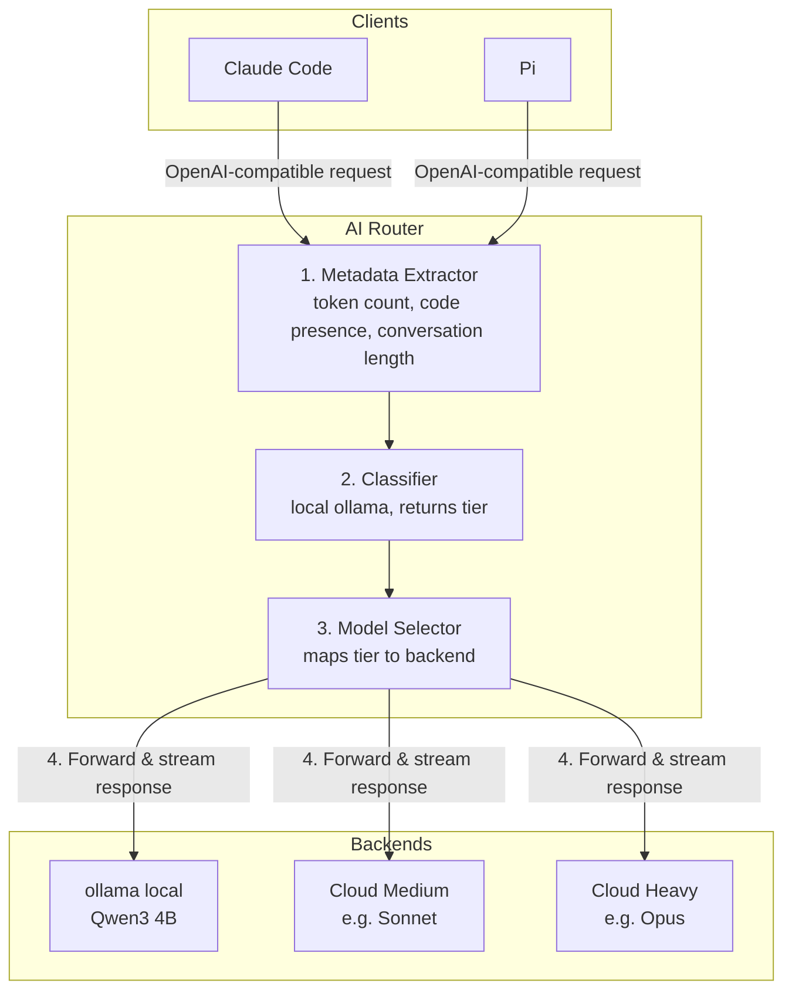

# AI Router Design Spec

## Purpose

A local, self-hosted AI prompt router that classifies incoming requests by complexity and routes them to the appropriate model tier. Exposes an OpenAI-compatible API so any client (Claude Code, Pi, curl) can use it as a drop-in endpoint.

## Architecture



## API Surface

| Endpoint | Purpose |
|----------|---------|
| `POST /v1/chat/completions` | Classify and forward |
| `GET /v1/models` | List available models (all tiers + `auto`) |
| `GET /health` | Liveness check |

### Request Handling (`/v1/chat/completions`)

- `model: "auto"` (or omitted) - run classifier, pick tier, forward
- `model: "<specific-model>"` with `passthrough_model: true` - skip classifier, forward directly
- `model: "<tier-name>"` - skip classifier, use that tier

### Response

Identical to backend response (transparent proxy). Adds `X-Router-Tier: <tier>` header for debugging.

### Authentication

Optional bearer token for the router itself (configured in YAML). Backend credentials referenced by env var name.

## Configuration

```yaml
server:
  port: 8080
  host: 0.0.0.0

classifier:
  endpoint: http://localhost:11434
  model: qwen3:4b
  system_prompt: |
    You are a prompt router. Given a user message and metadata,
    classify it into one of the available tiers.
    Respond with JSON: {"tier": "<tier_name>", "reason": "<brief reason>"}
  metadata:
    - token_count
    - has_code
    - conversation_turns
    - last_message_length
  timeout_ms: 5000

tiers:
  - name: local
    description: Simple questions, formatting, short factual answers
    models:
      - name: qwen3:4b
        endpoint: http://localhost:11434
        type: ollama
  - name: medium
    description: Moderate reasoning, summarization, standard coding tasks
    models:
      - name: claude-sonnet
        endpoint: https://api.anthropic.com
        type: anthropic
        api_key_env: ANTHROPIC_API_KEY
  - name: heavy
    description: Complex analysis, large codebases, multi-step reasoning
    models:
      - name: claude-opus
        endpoint: https://api.anthropic.com
        type: anthropic
        api_key_env: ANTHROPIC_API_KEY

routing:
  default_tier: medium
  passthrough_model: true
```

### Key Config Decisions

- Tiers can have multiple models (future: capability-based selection within a tier)
- `passthrough_model: true` lets clients bypass routing by specifying a model explicitly
- API keys referenced by env var name, never stored in config
- Classifier timeout with fallback to `default_tier`

## Metadata Extractor

Computed before calling the classifier:

| Signal | How computed |
|--------|-------------|
| `token_count` | Approximate token count of full message array (whitespace split / 0.75) |
| `has_code` | Code fences or common code patterns detected |
| `conversation_turns` | Number of messages in the array |
| `last_message_length` | Character count of the final user message |

Passed to the classifier as structured context alongside the user's last message.

### Classifier Prompt Format

```
Metadata: {"token_count": 1200, "has_code": true, "conversation_turns": 8, "last_message_length": 450}

User message: <last user message>

Classify into one of: local, medium, heavy
```

Response: `{"tier": "heavy", "reason": "multi-turn coding conversation with large context"}`

## Streaming Proxy

- Opens streaming connection to selected backend
- Pipes SSE chunks (`data: {...}\n\n`) directly to client
- If client sends `stream: false`, waits for full response

### Error Handling

- Backend error (429, 500, etc.) - returned to client as-is
- Classifier timeout/error - fall back to `default_tier`, log warning
- Backend unreachable - return 502 to client
- No retry logic, no failover between tiers (clients handle retries)

## Client Compatibility

### Claude Code

Set custom endpoint in Claude Code config:
- `base_url: http://localhost:8080`
- Use `model: "auto"` for routed requests, or specific model names for passthrough

### Pi

Configure in `models.json` as a custom provider:
- Point provider endpoint at `http://localhost:8080`
- Models list populated from router's `/v1/models`

## Non-Goals (v1)

- No retry/failover between backends
- No request/response caching
- No usage tracking or billing
- No web UI
- No multi-model selection within a tier (always picks first model in tier)

## Future Extensions

- Capability tags on models (coding, vision, multilingual) for within-tier selection
- Request logging and analytics
- Cost tracking
- Configurable rules engine (regex, keyword triggers) as pre-classifier fast path
