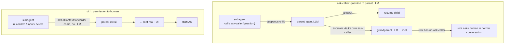

# Subagent escalation, context inheritance & accounting

- Date: 2026-06-21
- Status: design approved, pending implementation plan
- Extensions touched: `task` (major), `safe-bash` (allow-always grant), `model-router` (logging fixes)

## Motivation

The `task` subagent tool works but is opaque and isolated:

- A subagent has no way to ask a question. If it needs input it either stalls or returns a half-answer.
- Permission prompts inside a subagent (e.g. `safe-bash` confirm) auto-deny via the headless `noOpUIContext` - no human ever sees them.
- Subagent token usage is invisible; nothing is summed into the UI.
- The subagent does not inherit the parent's system prompt, so it lacks context to work well.
- A nested Bedrock call with no client-side ceiling can hang the whole session (observed: 0% CPU, no socket, never exits).
- `model-router` logs a misleading model on its default path, and cannot distinguish a failed classifier from a skipped one.

## Scope

In scope: question escalation to the parent agent, permission escalation to the human, parent-set timeout, context inheritance, token summing, subagent logging, and the two `model-router` logging fixes.

Out of scope (deferred): depth/recursion limits. Subagents may spawn subagents with no cap for now.

## Key facts the design relies on

- All sessions run in **one Node process** (`createAgentSession` is in-process), so module-level state is shared across parent and children.
- UI context is injected post-creation: `session.extensionRunner.setUIContext(uiContext, mode)`.
- `session.subscribe(listener)` streams `message_*` / `tool_execution_*` / `turn_*` events.
- `session.getSessionStats().tokens` (`{ input, output, cacheRead, cacheWrite, total }`) is readable after `prompt()`.
- The parent reads its own system prompt via `ctx.getSystemPrompt()`.
- A child's own session id is available in a tool via `ctx.sessionManager.getSessionId()`.
- System prompt / skills reach a child only through a `DefaultResourceLoader` (`systemPrompt`, `appendSystemPrompt` options); skills load from disk by default.

## Architecture

Two independent escalation channels:



- **Questions** go to the parent **agent** (LLM), which may answer or escalate one level up. Only the root agent reaches the human, and it does so through ordinary conversation (root has no `ask-caller` tool).
- **Permissions** go straight to the **human** through the UI-context chain. Each subagent's UI context is its parent's `ctx.ui`; the root's is the real TUI. No intermediate LLM is involved.

## Components

### Shared subagent registry

Module-level `Map<childSessionId, ChildEntry>` in the `task` extension. `ChildEntry`:

```ts
interface ChildEntry {
  session: AgentSession;
  resolveAsk?: (answer: string) => void; // set while suspended awaiting an answer
  questionSignal: Deferred<{ question: string }>; // re-armed each run segment
  tokensTotal: number;
  status: "running" | "awaiting_answer" | "completed" | "aborted" | "timeout";
  startedAt: number;
}
```

### `task` tool (revised)

Parameters:

| Param | Type | Notes |
| --- | --- | --- |
| `prompt` | string | Required on a fresh spawn. Standalone instructions. |
| `model_tier` | `light\|medium\|heavy`? | Optional. Resolves via `model-rules.json` map (unchanged). |
| `tools` | string[]? | Optional allowlist for the child. |
| `timeout_ms` | number? | Optional. Bounds each active run segment (see Timeout). Parent sets a sane value. |
| `resume` | string? | A child session id returned by a prior `awaiting_answer` result. |
| `answer` | string? | The answer to feed a resumed child. Required with `resume`. |

Behaviour - the tool no longer awaits `prompt()` to completion; it **races** the child's run against its `questionSignal`:

1. **Fresh spawn** (`prompt` given, no `resume`): resolve `model_tier` → model, build child via `createAgentSession` with the inherited resource loader (see Context inheritance), register `ask-caller` + `task` for the child, `setUIContext(ctx.ui, mode)`, `subscribe` for status/logging, store in registry, start `child.prompt(prompt)`.
2. **Resume** (`resume` + `answer`): look up the registry entry, call its `resolveAsk(answer)` to wake the suspended child, re-arm `questionSignal`.
3. Either way, `await Promise.race([ runCompletes, questionRaised, timedOut ])`:
   - **Completes** → read `getSessionStats().tokens`, log `completed`, dispose, drop from registry, return final text + token summary.
   - **Question raised** → set status `awaiting_answer`, log `asked`, return `{ status: "awaiting_answer", question, resume: childSessionId }` to the parent LLM. Child stays alive, suspended inside `ask-caller`.
   - **Timed out** → `session.abort()`, log `timeout`, dispose, return an error result.

Result `details` always include `model_tier`, resolved model, `tokensTotal`, `status`.

### `ask-caller` tool (subagents only)

Registered only on child sessions, never the root. `execute(_id, { question }, _signal, _onUpdate, ctx)`:

```ts
const myId = ctx.sessionManager.getSessionId();
const entry = registry.get(myId);
return new Promise<AgentToolResult>((resolve) => {
  entry.resolveAsk = (answer) => resolve({ content: [{ type: "text", text: answer }], details: {} });
  entry.questionSignal.resolve({ question }); // wakes the parent's task.execute
});
```

The returned promise suspends the child inside the tool until the parent calls `task` with `resume`/`answer`.

### Permission forwarding

On spawn: `childSession.extensionRunner.setUIContext(ctx.ui, mode)`. The child's `ui.confirm/input/select` then delegate straight to the parent's `ctx.ui`, which is itself a forwarder for nested parents and the real TUI at the root. Synchronous call chain, no LLM, terminates at the human.

### Shared permission grants (`safe-bash`)

Pi core has no dynamic "allow always" for tool calls (`ui.confirm` returns a bare boolean; `remember` exists only for project trust). The persistent, already-shared grant store is the static `bashSafety.allowlist` in `~/.pi/agent/settings.json` - every session and subagent calls `loadRules` from that same file on each `tool_call`, so an allowlisted command never prompts anyone. A previously-granted command therefore never re-escalates, including from a different subagent. This satisfies "don't ask again what was granted from now on" by reusing the existing check; the escalation/forwarding layer is untouched.

To add a dynamic grant, `safe-bash` replaces its boolean `confirm` with a three-way `ui.select(["Allow once", "Allow always", "Deny"])`:

- **Allow once** → approve this call only.
- **Deny** → block.
- **Allow always** → `ui.editor("Allowlist pattern", <suggested glob>)` lets the human edit a prefilled suggestion (default: first-token glob, e.g. `git push foo` → `git push *`), then append the edited pattern to `bashSafety.allowlist` in `settings.json`. Because `loadRules` re-reads the file every `tool_call`, the grant is immediately shared across all current and future subagents and persisted across restarts - no new cache or store.

The human controls the final pattern via the editor, so over-granting is their explicit choice, not an auto-generated guess.

### Context inheritance

```ts
const loader = new DefaultResourceLoader({
  cwd: ctx.cwd,
  agentDir,
  systemPrompt: ctx.getSystemPrompt(),
  appendSystemPrompt: ["You are a subagent. Use the `ask-caller` tool to ask your caller a question."],
});
await loader.reload();
const { session } = await createAgentSession({ cwd: ctx.cwd, modelRegistry: ctx.modelRegistry, resourceLoader: loader, ...(model ? { model } : {}), ...(tools ? { tools } : {}) });
```

Skills are loaded from disk by the default loader, so they inherit automatically.

### Token accounting

After each run segment (completion or question) read `child.getSessionStats().tokens.total`, update `entry.tokensTotal`, add the delta to a process-wide running total, and push a one-line status to the root via `ctx.ui.setStatus("subagents", "<n> subagents, <total> tok")`. Per-child totals are also written to the log.

### Subagent log

`~/.pi/subagent.jsonl`, harness JSONL style (mirrors `model-decisions.jsonl`):

```ts
interface SubagentEvent {
  ts: string;
  parentSession: string;
  childSession: string;
  model: string;
  tokens: number;          // cumulative for this child
  status: "spawned" | "asked" | "answered" | "completed" | "aborted" | "timeout";
  durationMs: number;      // since child start
}
```

### Live status streaming

`session.subscribe` is used only to keep the one-line `ctx.ui.setStatus` current (e.g. `"subagent: 1.2k tok, running"`). The child's full message stream is **not** rendered inline. The structured detail lives in `subagent.jsonl`.

### `model-router` logging fixes (independent commit)

1. Default branch (`index.ts:115-117`): log the real model `(ctx.model as { id?: string })?.id ?? config.defaultModel` instead of `config.defaultModel ?? ctx.model.id`, so a model set by `task`/`model_tier` is reported truthfully.
2. When `ollamaUrl`/`ollamaModel` are set but `callOllama` returns null, log `reason: "ollama-failed"` (add to the `RouterDecision.reason` union) rather than falling through silently to `reason: "default"`.

## Timeout semantics

`timeout_ms` bounds a single **active run segment** - from spawn (or resume) until the child next completes or raises a question. The timer is cleared while the child is `awaiting_answer`, so a slow parent answer never kills a healthy child. On expiry: abort, log `timeout`, dispose, return an error result to the parent.

## Error handling

- Parent abort signal wired to `session.abort()` (as today) and registry cleanup in `finally`.
- Child `prompt()` throws → log `aborted`, dispose, return an error result.
- `resume` for an unknown/cleaned-up child id → return an error result, do not throw.
- Always `dispose()` and drop from the registry on any terminal status.

## Testing

- `ask-caller` resolves its promise with the supplied answer; suspends until then.
- `task` race: completion path returns final text + tokens; question path returns `awaiting_answer` with a resume id; resume path wakes the child.
- `timeout_ms` aborts a non-responsive segment and is paused during `awaiting_answer`.
- Registry entries are removed on completion, abort, and timeout.
- Token totals accumulate across resume segments.
- `safe-bash`: allowlisted command never prompts; "Allow always" appends the human-edited pattern to `settings.json` and the next matching call is auto-approved without prompting.
- `model-router`: default branch logs the session model, not `defaultModel`; classifier-null logs `ollama-failed`.
- Existing `lastAssistantText` test retained.

## Minor decisions

- `ask-caller` is registered only on child sessions; the root never gets it.
- The resume handle is the child session id, returned verbatim in the `awaiting_answer` result.
- Live status is a single `setStatus` line; no inline child rendering.
